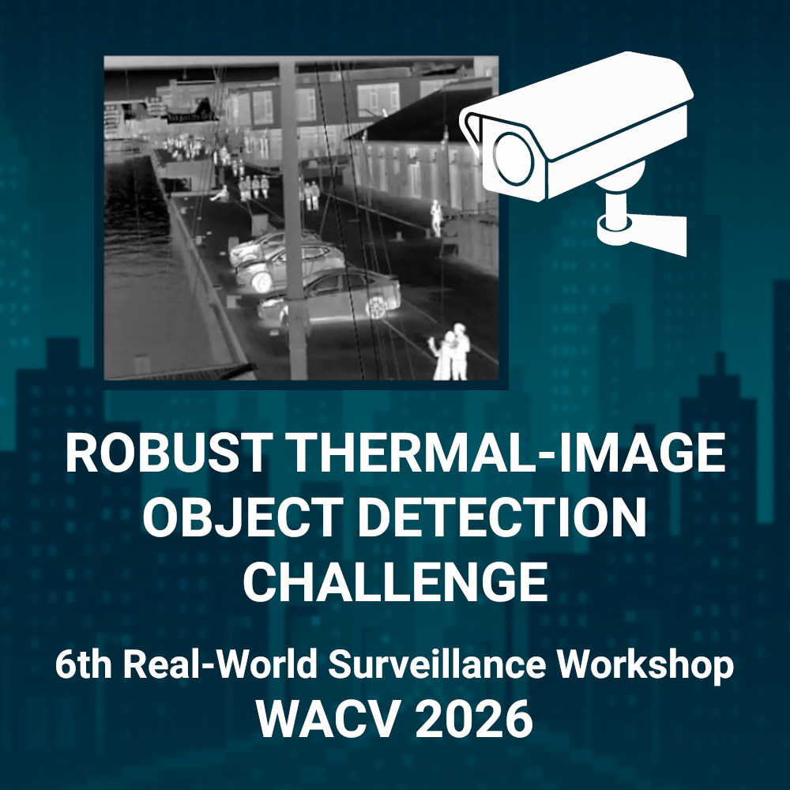

# **RTIOD: Robust Thermal-Image Object Detection challenge**

*This is the official Repository of the RTIOD - Robust Thermal-Image Object Detection Challenge at WACV 2026 (RTIOD@WACV2026)*

## Information

[RWS@WACV2026](https://vap.aau.dk/rws/) introduces a new challenge on Robust Thermal-Image Object Detection using the LTDv2 dataset, benchmarking multi-object detection under long-term thermal drift. Real-world conditions like ambient changes, sensor aging, and weather dynamics cause performance degradation, especially in thermal imagery, which relies on shape cues and temperature differentials.

The challenge will be run on Codabench. Rules and objectives on the Codabench challenge [official page](https://www.codabench.org/competitions/10954/).

Challenge dataset: **LTDv2** [paper](https://www.techrxiv.org/doi/full/10.36227/techrxiv.175339329.95323969) [dataset](https://huggingface.co/datasets/vapaau/LTDv2)

A starting kit to run some baseline experiments with YOLO is available [here](doc/starting_kit/), but feel free to reimplement from scratch all the code ;) 

Associated workshop at WACV2026: [Real-World Surveillance: Applications and Challenges Workshop, 6th](https://vap.aau.dk/rws/)

## Important dates
- October 17th:  Start of competition and Development Phase
- December 1st: Start of Testing Phase and end of Development Phase
- December 7th: End of competition
- December 7th: Paper submission deadline
- December 14th: Paper submission deadline (Challenge Participants)
- December 23rd: Decision notification
- January 9th 11:59 PM, PT: Camera-ready deadline
